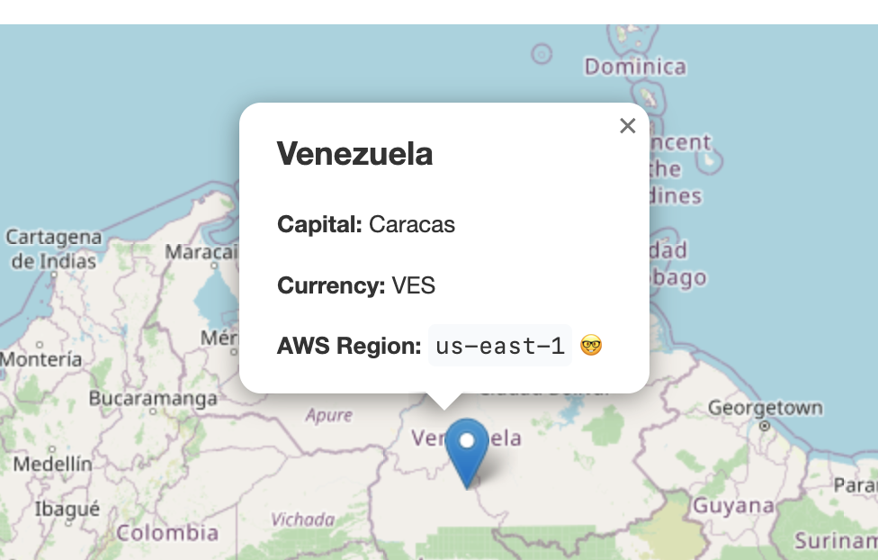
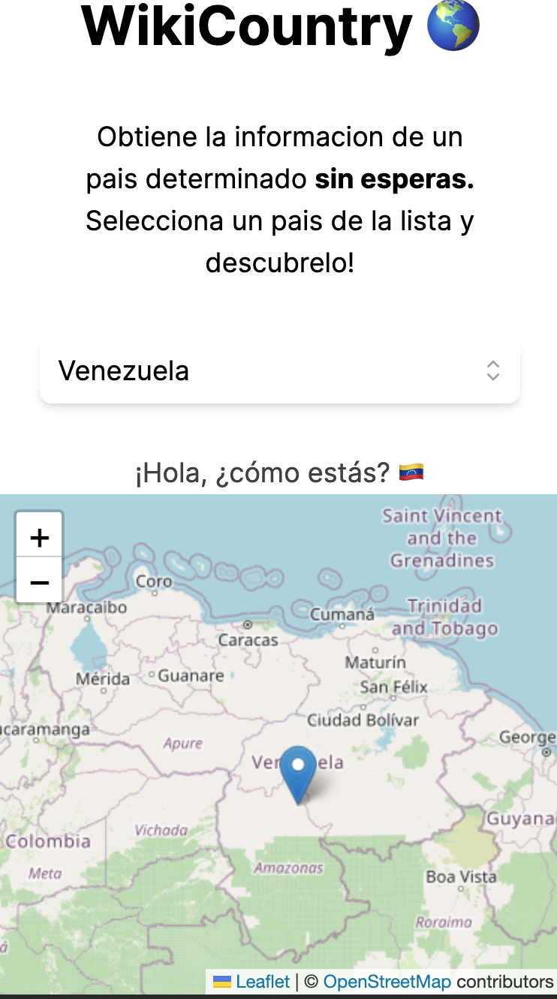
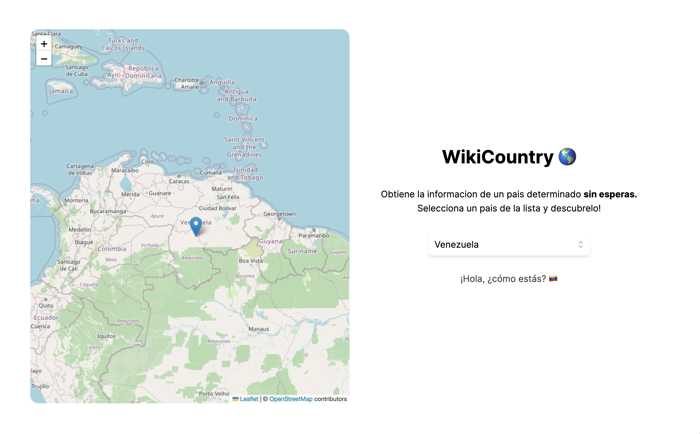

# WikyCountry 🌎

Get information about a specific country without waiting. Choose a country from the list and discover it!

## Getting Started

This is a [Next.js](https://nextjs.org/) project bootstrapped with [`create-next-app`](https://github.com/vercel/next.js/tree/canary/packages/create-next-app).

### To run the application, follow these steps:

#### Environment variables

So far, the only variable configured in the app is the API of the countries services. Please create your own `.env` file to set this

```
API_COUNTRIES=https://countries.trevorblades.com/
```

#### Installation

```bash
pnpm install
pnpm dev
```

You can run the app with whatever you want like `npm`, `yarn`. I choosed pnpm for development purposes.

## Features

- The main list of countries is obtained from a mock file `countries.json`.
- The application is responsive and supports major resolutions.
- The map pin is marked according to the data obtained from the `countries.json` file.
- It includes basic accessibility features such as metadata and descriptions.
- There are configuration files for Visual Studio Code containing the necessary settings for working on the app.
- You can access more information about the selected country by clicking on the map pin.

## Screenshots





